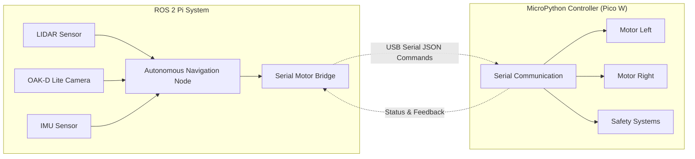

# ROS 2 Autonomous Navigation System

## Serial MicroPython Motor Controller Integration

This system enables autonomous navigation for a robot using LIDAR and depth camera data, with a MicroPython-based motor controller communicating via USB serial.

## Architecture Overview



## Hardware Requirements

### ROS 2 Pi System
- Raspberry Pi 4B (8GB recommended)
- RPLIDAR A1M8 or compatible LIDAR
- OAK-D Lite depth camera
- IMU (integrated with OAK-D Lite)

### MicroPython Motor Controller

- Raspberry Pi Pico W
- L298N or compatible motor driver
- 2x DC motors (differential drive)
- USB serial connectivity (via USB cable to Pi)

## Software Components

### 1. MicroPython Controller (`ros2_serial_main.py`)

- **Purpose**: Motor control and safety systems
- **Communication**: USB serial JSON commands on `/dev/ttyACM0`
- **Features**:
  - Smooth speed ramping to prevent tipping
  - Emergency stop capabilities
  - Command timeout safety
  - Autonomous mode toggle
  - Real-time status reporting

### 2. Serial Motor Bridge (`serial_motor_bridge.py`)

- **Purpose**: Bridge between ROS 2 and MicroPython controller
- **Communication**: USB serial at 115200 baud
- **Services**:
  - `/motor/move` - Move robot commands
  - `/motor/rotate` - Rotate robot commands  
  - `/motor/stop` - Stop movement
  - `/motor/emergency_stop` - Emergency stop
- **Topics**:
  - `/motor_controller/status` - Controller status
  - `/cmd_vel` - Velocity commands

### 3. ROS 2 Navigation Node (`autonomous_navigation_node.py`)

- **Purpose**: Process sensor data and make navigation decisions
- **Subscriptions**:
  - `/scan` - LIDAR data
  - `/oak/depth/image_raw` - Depth camera
  - `/oak/rgb/image_raw` - RGB camera
  - `/oak/points` - Point cloud data
- **Services**:
  - `/emergency_stop` - Emergency stop trigger
  - `/set_autonomous_mode` - Enable/disable autonomous navigation

### 4. Launch System (`pi.autonomous.serial.launch.py`)

- **Purpose**: Start complete autonomous navigation system
- **Includes**: Full sensor suite + serial bridge + navigation node
- **Parameters**: Configurable navigation behavior and serial communication

### 5. Control Utility (`serial_nav_control.py`)

- **Purpose**: Easy control interface for serial communication
- **Features**: Command-line control, status monitoring, manual override

## Installation & Setup

### 1. Deploy MicroPython Code

```bash
# Connect to MicroPython device
mpremote a0 fs cp src/labrobot/upython/ros2_serial_main.py :main.py

# Also copy wifi config if needed
mpremote a0 fs cp src/labrobot/upython/wifi_config.py :wifi_config.py

# Verify deployment
mpremote a0 ls
```

### 2. Build ROS 2 Workspace

```bash
cd ~/lab_ws
colcon build --packages-select labrobot
source install/setup.bash
```

### 3. Make Scripts Executable

```bash
chmod +x src/labrobot/scripts/autonomous_navigation_node.py
chmod +x src/labrobot/scripts/serial_motor_bridge.py
chmod +x src/labrobot/scripts/serial_nav_control.py
```

## Usage

### Start Complete Autonomous System

```bash
# Launch full autonomous navigation (serial communication)
ros2 launch labrobot pi.autonomous.serial.launch.py

# With custom parameters
ros2 launch labrobot pi.autonomous.serial.launch.py \
  serial_port:=/dev/ttyACM0 \
  baudrate:=115200 \
  autonomous_enabled:=true \
  max_speed:=60 \
  min_obstacle_distance:=0.8
```

### Control Commands

```bash
# Emergency stop
python3 src/labrobot/scripts/serial_nav_control.py --emergency-stop

# Enable autonomous mode
python3 src/labrobot/scripts/serial_nav_control.py --autonomous on

# Disable autonomous mode  
python3 src/labrobot/scripts/serial_nav_control.py --autonomous off

# Monitor status
python3 src/labrobot/scripts/serial_nav_control.py --monitor

# Manual control (when autonomous is off)
python3 src/labrobot/scripts/serial_nav_control.py --move forward --speed 50
python3 src/labrobot/scripts/serial_nav_control.py --rotate left --speed 40
python3 src/labrobot/scripts/serial_nav_control.py --stop
```

### ROS 2 Service Calls

```bash
# Emergency stop
ros2 service call /emergency_stop std_srvs/srv/Trigger

# Toggle autonomous mode
ros2 service call /set_autonomous_mode std_srvs/srv/SetBool "data: true"
ros2 service call /set_autonomous_mode std_srvs/srv/SetBool "data: false"

# Check navigation status
ros2 topic echo /motor_controller/status
ros2 topic echo /navigation/state
```

### Direct Serial Communication

```bash
# Test controller directly via serial (if needed for debugging)
python3 -c "
import serial
import json
ser = serial.Serial('/dev/ttyACM0', 115200, timeout=1)
# Send status request
ser.write(json.dumps({'command': 'status'}).encode() + b'\n')
response = ser.readline().decode()
print('Response:', response)
ser.close()
"
```

## Navigation Algorithm

### Obstacle Avoidance Logic
1. **LIDAR Analysis**: Scan front 90° range for obstacles
2. **Distance Check**: Stop if obstacle < `min_obstacle_distance`
3. **Path Planning**:
   - **Clear path**: Move forward at adaptive speed
   - **Left clear**: Rotate left to avoid obstacle
   - **Right clear**: Rotate right to avoid obstacle
   - **Both clear**: Choose direction with more space
   - **No clear path**: Back up and reassess

### Safety Features

- **Command Timeout**: Stop if no command received within 2 seconds
- **Emergency Stop**: Immediate motor shutdown with override
- **Speed Ramping**: Smooth acceleration/deceleration
- **Serial Communication**: Reliable USB connection with reconnection handling

## Configuration Parameters

| Parameter | Default | Description |
|-----------|---------|-------------|
| `serial_port` | /dev/ttyACM0 | USB serial port for controller |
| `baudrate` | 115200 | Serial communication baudrate |
| `autonomous_enabled` | false | Start with autonomous mode |
| `min_obstacle_distance` | 0.5 | Obstacle detection distance (m) |
| `max_speed` | 70 | Maximum motor speed (%) |
| `default_speed` | 50 | Default forward speed (%) |
| `rotation_speed` | 40 | Rotation speed (%) |
| `scan_angle_range` | 90 | LIDAR scan range (degrees) |
| `command_timeout` | 2.0 | Safety timeout (seconds) |

## Troubleshooting

### Serial Controller Not Connected

If you see `Motor Controller: ❓ NO STATUS RECEIVED` and `Controller Connected: ❌ NO`:

```bash
# 1. Check if MicroPython device is connected
ls -la /dev/ttyACM*
# Should show: /dev/ttyACM0 (or similar)

# 2. Check USB device detection
dmesg | tail -20
# Look for: "cdc_acm" or "USB" device messages

# 3. Test direct serial communication
python3 src/labrobot/scripts/test_micropython_controller.py

# 4. Check if MicroPython is running the correct code
mpremote a0 ls
# Should show: main.py

# 5. Check MicroPython serial output
mpremote a0 repl
# Press Ctrl+C to interrupt, then check for errors
# Press Ctrl+D to soft reset and see startup messages

# 6. Verify serial bridge is running
ros2 topic list | grep motor
# Should show: /motor_controller/status

# 7. Check serial bridge logs
ros2 topic echo /motor_controller/status --once
```

### Common Solutions for "NO STATUS RECEIVED"

**Step 1: Verify Hardware Connection**
```bash
# Check if Pico W is detected
lsusb | grep -i "Raspberry Pi"
# OR check for any USB serial device
ls -la /dev/ttyACM* /dev/ttyUSB*
```

**Step 2: Deploy/Restart MicroPython Code**
```bash
# Re-deploy the serial main script
mpremote a0 fs cp src/labrobot/upython/ros2_serial_main.py :main.py

# Restart MicroPython (this will run main.py)
mpremote a0 reset
```

**Step 3: Test Serial Communication**
```bash
# Test with the dedicated test script
python3 src/labrobot/scripts/test_micropython_controller.py

# If that works, test the nav control script
python3 src/labrobot/scripts/serial_nav_control.py --status
```

**Step 4: Check Serial Bridge Service**
```bash
# Make sure the serial bridge is running
ros2 node list | grep serial_motor_bridge
# If NO OUTPUT: The serial bridge node is not running!

# Check if it's receiving/sending data (only if node is running)
ros2 topic echo /motor_controller/status --max-count 5

# If serial bridge is missing, check launch logs:
ros2 topic echo /motor_controller/status --max-count 5
```

**Step 4a: If Serial Bridge Node is Missing**
```bash
# Check if the launch file started all nodes
ros2 node list
# Expected nodes: autonomous_navigation_node, serial_motor_bridge, and sensor nodes
# If you see serial_navigation_controller instead of serial_motor_bridge,
# this indicates an old/different version of the scripts

# Try running the serial bridge manually to see errors:
python3 src/labrobot/scripts/serial_motor_bridge.py
# Common errors:
# - ModuleNotFoundError: No module named 'example_interfaces'
# - Permission denied
# - Serial port access issues

# Check file permissions and existence
ls -la src/labrobot/scripts/serial_motor_bridge.py
# Should be executable (x permission)

# If the file doesn't exist in install directory:
ls -la install/labrobot/share/labrobot/scripts/serial_motor_bridge.py
```

**Step 4b: Fix ModuleNotFoundError for 'example_interfaces'**
```bash
# Install missing ROS 2 package
sudo apt update
sudo apt install ros-jazzy-example-interfaces

# Alternative: Install all common ROS 2 interface packages
sudo apt install ros-jazzy-common-interfaces

# Verify installation
ros2 interface list | grep example_interfaces
# Should show various example_interfaces services

# Try running the serial bridge again
python3 src/labrobot/scripts/serial_motor_bridge.py
```

**Step 4c: Copy Scripts to Install Directory**
```bash
# If scripts are missing from install directory, copy them:
mkdir -p install/labrobot/share/labrobot/scripts
cp src/labrobot/scripts/*.py install/labrobot/share/labrobot/scripts/

# Make sure they're executable
chmod +x install/labrobot/share/labrobot/scripts/*.py

# Restart the launch file
# Press Ctrl+C to stop current launch, then:
ros2 launch labrobot pi.autonomous.serial.launch.py
```

**Step 5: Verify Launch File**
```bash
# Stop current launch and restart with verbose output
ros2 launch labrobot pi.autonomous.serial.launch.py
# Check for any error messages about serial communication
```

### Motor Issues

```bash
# Test manual control via serial
python3 src/labrobot/scripts/serial_nav_control.py --move forward --speed 30
python3 src/labrobot/scripts/serial_nav_control.py --stop

# Check emergency stop status
python3 src/labrobot/scripts/serial_nav_control.py --status
```

### Sensor Issues

```bash
# Verify sensor data
ros2 topic echo /scan --max-count 1
ros2 topic echo /oak/depth/image_raw --max-count 1

# Check launch system
ros2 launch labrobot pi.basic.sensors.launch.py
```

## Development Notes

### Adding New Navigation Behaviors
1. Modify `analyze_lidar_obstacles()` in `autonomous_navigation_node.py`
2. Update `navigation_loop()` for new decision logic
3. Add corresponding MicroPython commands if needed

### Tuning Parameters
- **Obstacle Distance**: Increase for more cautious navigation
- **Speed Settings**: Adjust for robot weight/power
- **Scan Range**: Modify for different sensor coverage
- **Timeout Values**: Balance safety vs responsiveness

## Safety Considerations

⚠️ **IMPORTANT SAFETY NOTES**:
- Always test in a safe, enclosed area first
- Keep emergency stop accessible at all times
- Monitor initial runs closely
- Verify obstacle detection before autonomous operation
- Check motor direction/wiring before first use

## Status Monitoring

The system provides comprehensive status information:
- **Controller connectivity and health**
- **Autonomous mode state**
- **Current movement and speed**
- **Obstacle detection status**
- **Emergency stop state**
- **Command timing and safety**

Use `serial_nav_control.py --monitor` for real-time status display.

## Starting Movement

### System Status Check

Before starting movement, verify the system is ready:

```bash
# Check current status
python3 src/labrobot/scripts/serial_nav_control.py --status
```

Expected ready status:
- 🔗 Motor Controller: ✅ CONNECTED  
- 🚨 Emergency Stop: ✅ NORMAL
- 🔗 Controller Connected: ✅ YES

### Starting Autonomous Navigation

Once the system shows it's connected and emergency stop is cleared:

```bash
# Method 1: Enable autonomous mode (if not already enabled)
python3 src/labrobot/scripts/serial_nav_control.py --autonomous on

# Method 2: Use ROS 2 service call
ros2 service call /set_autonomous_mode std_srvs/srv/SetBool "data: true"
```

**Important**: The navigation system will only start moving when:
1. Autonomous mode is enabled ✅
2. Emergency stop is cleared ✅  
3. A clear path is detected (no obstacles in front)
4. LIDAR sensor is providing valid scan data

### Manual Movement (Testing)

For testing or manual control, disable autonomous mode first:

```bash
# Disable autonomous mode
python3 src/labrobot/scripts/serial_nav_control.py --autonomous off

# Manual movement commands
python3 src/labrobot/scripts/serial_nav_control.py --move forward --speed 30 --duration 2
python3 src/labrobot/scripts/serial_nav_control.py --rotate left --speed 25 --duration 1
python3 src/labrobot/scripts/serial_nav_control.py --stop
```

### Troubleshooting "Idle" Status

If the system shows "Current Action: idle" but won't move:

```bash
# 1. Check LIDAR data is available
ros2 topic echo /scan --max-count 1
# Should show laser scan data, not empty

# 2. Check for obstacles in front
# Look at the LIDAR ranges in the front sector (center of array)
# Values should be > min_obstacle_distance (default 0.5m)

# 3. Verify navigation node is processing
ros2 topic echo /navigation/state
# Should show navigation decisions and obstacle analysis

# 4. Check navigation logs
# Look at terminal where launch file is running for navigation messages

# 5. Force a navigation decision (if safe)
# Temporarily reduce obstacle distance parameter
ros2 launch labrobot pi.autonomous.serial.launch.py min_obstacle_distance:=0.3
```

### Quick Start Checklist

1. ✅ **System Connected**: Controller shows CONNECTED status
2. ✅ **Emergency Stop Clear**: Shows NORMAL (not ACTIVE)  
3. ✅ **Autonomous Mode**: Enable with `--autonomous on`
4. ✅ **Clear Path**: Check LIDAR shows no close obstacles
5. ✅ **Sensor Data**: Verify `/scan` topic has valid data
6. 🚀 **Movement**: Should start automatically when path is clear

### Emergency Commands

Always keep these ready:

```bash
# Immediate stop
python3 src/labrobot/scripts/serial_nav_control.py --emergency-stop

# Quick disable autonomous
python3 src/labrobot/scripts/serial_nav_control.py --autonomous off

# Manual stop
python3 src/labrobot/scripts/serial_nav_control.py --stop
```
