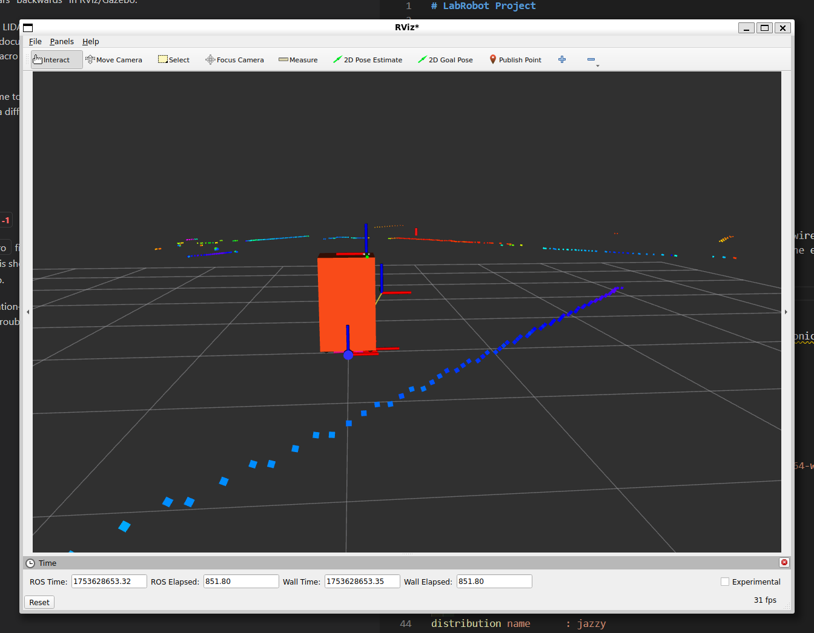
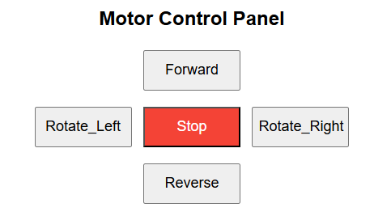

# LabRobot Project


LabRobot Project 

Hardware:

# Labrobot Project Notes

## Bill of Materials

TODO: Add Bill of Materials (BOM) for the LabRobot project.

## 2025-07-27
- 23 days later
- finally 3D printed the base and lidar + camera mount
- did a lot of learning about basic wiring and electronics; rewired things a few times
- using a Pico(W) + micropython to control the motors and (read the encoders). I just happened to have a Pico W lying around but a non-W Pico would work just as well. 
- got the Slamtec C1 LIDAR working with ROS 2 Jazzy
- Had to rotate the z-axis of the lidar joint by 3.14 radians (180 degrees) to get it to point in the right direction. Apparently this is a common issue. (figure1)
- Since I'm using a PicoW, I added a web server to the robot movement for testing. The micropython code will change later for use with ROS2. see: [main.py](../upython/main.py)
- 





## 2025-07-04 
- Restarting project, targeting ROS2 Jazzy LTS and Gazebo Harmonic LTS. 
- Jazzy Jalisco (May 2024 - May 2029)
- Gazebo Harmonic (September 2023 - September 2028)

```sh
$ ros2 doctor --report
...
   PLATFORM INFORMATION
system           : Linux
platform info    : Linux-6.6.87.2-microsoft-standard-WSL2-x86_64-with-glibc2.39
release          : 6.6.87.2-microsoft-standard-WSL2
processor        : x86_64

   QOS COMPATIBILITY LIST
compatibility status    : No publisher/subscriber pairs found

   RMW MIDDLEWARE
middleware name    : rmw_fastrtps_cpp

   ROS 2 INFORMATION
distribution name      : jazzy
distribution type      : ros2
distribution status    : active
release platforms      : {'debian': ['bookworm'], 'rhel': ['9'], 'ubuntu': ['noble']}

   TOPIC LIST
topic               : none
publisher count     : 0
subscriber count    : 0
```

```sh
$ gz sim --version
Gazebo Sim, version 8.9.0
Copyright (C) 2018 Open Source Robotics Foundation.
Released under the Apache 2.0 Licens
```

### `colcon build --symlink-install`

`colcon` is the recommended build tool for ROS 2 projects. It supports building multiple packages in a workspace and handles dependencies automatically.

`colcon build` is the command used to build all packages in the current workspace. It will compile the source code, generate necessary files, and prepare the packages for use. However, this command will need to be run each time you make changes to the source code or add new packages.

**Recommended** `colcon build --symlink-install` instead creates symbolic links to the source files instead of copying them into the build directory. This allows for faster development since changes made in the source files are immediately reflected in the build without needing to rebuild the entire package.

## Common Issues and Resolutions

### 1. RTPS_TRANSPORT_SHM Error in WSL or Container

**Issue:**
```
[robot_state_publisher-1] [RTPS_TRANSPORT_SHM Error] Failed init_port fastrtps_port7000: open_and_lock_file failed -> Function open_port_internal
```
**Resolution:**
This is a warning from Fast DDS about shared memory transport not being available (common in WSL or containers). It does not prevent ROS 2 from working. 

To suppress the warning, disable shared memory transport:
```sh
export RMW_FASTRTPS_USE_SHM=OFF
```

or just close and restart the terminal.


### 2. Package 'joint_state_publisher_gui' not found

**Issue:**
```
ros2 run joint_state_publisher_gui joint_state_publisher_gui
Package 'joint_state_publisher_gui' not found
```
**Resolution:**
Install the package for ROS 2 Jazzy:
```sh
sudo apt update
sudo apt install ros-jazzy-joint-state-publisher-gui
```
**What it is for:**
`joint_state_publisher_gui` provides a graphical interface to manually set and adjust the positions of robot joints. This is especially useful for visualizing and testing robot models in RViz or Gazebo when no real hardware or controllers are available. It allows you to interactively move joints and see the resulting robot pose in real time.

## 2025-07-05: Simulation Bringup and Debugging Log

### Differential Drive Robot Simulation Setup (ROS 2 Jazzy + Gazebo Harmonic)

- Set up robot model using Xacro/URDF, including:
  - `robot.urdf.xacro` (main entry point)
  - `robot_core.xacro` (links, joints, properties)
  - `gazebo_control.xacro` (DiffDrive plugin and Gazebo integration)
  - `inertial_macros.xacro` (inertial macros)
- Created and updated launch files for simulation:
  - `rsp.launch.py`, `rsp_gz.launch.py`, `sim.launch.py`
  - Launches robot_state_publisher, joint_state_publisher_gui, gz sim, spawn_entity, and ros_gz_bridge
- Added and configured the Gazebo DiffDrive plugin for compatibility with gz sim:
  - Plugin block in `gazebo_control.xacro` uses correct joint names and topic names
  - Set `<topic>/model/labrobot/cmd_vel</topic>` to match the ROS-Gazebo bridge
- Added ROS-Gazebo bridge for:
  - `/clock`, `/model/labrobot/cmd_vel`, `/model/labrobot/odometry`, `/tf`
- Debugged and fixed:
  - Xacro macro inclusion issues (typos, missing includes)
  - Wheel and caster joint origins for correct placement
  - DiffDrive plugin topic mismatch (was `cmd_vel`, changed to `/model/labrobot/cmd_vel`)
  - Wheel joint axes: changed from `<axis xyz="0 0 1" />` (Z axis) to `<axis xyz="0 1 0" />` (Y axis) for correct wheel rotation
- Confirmed:
  - Robot spawns in simulation
  - `/model/labrobot/cmd_vel` messages are bridged and received
  - Robot now moves correctly in simulation

#### Key Lessons / Troubleshooting
- **DiffDrive plugin topic must match the bridged topic exactly** (use full `/model/labrobot/cmd_vel` path)
- **Wheel joint axes must be set to Y axis** (`<axis xyz="0 1 0" />`) for differential drive robots
- Use `ros2 topic echo` and `ros2 topic pub` to verify message flow
- Check simulation logs for plugin or physics errors if robot does not move

### Gazebo DiffDrive Plugin Notes

The Gazebo DiffDrive plugin (`gz::sim::systems::DiffDrive`) is responsible for simulating differential drive (two-wheeled) robot motion in Gazebo Sim. It reads velocity commands (Twist messages) from a specified topic and applies them to the wheel joints, simulating realistic robot movement.

**Key configuration points:**
- **Plugin block is included in `gazebo_control.xacro`.**
- **Joint names** must match the URDF exactly (e.g., `left_wheel_to_base_link`, `right_wheel_to_base_link`).
- **Topic** must match the fully qualified name used by the ROS-Gazebo bridge (e.g., `/model/labrobot/cmd_vel`).
- **Wheel separation and radius** should use Xacro properties for accuracy.
- **Odometry and TF**: The plugin can publish odometry and TF frames if configured.

**Example block:**
```xml
<plugin name="gz::sim::systems::DiffDrive" filename="gz-sim-diff-drive-system">
    <left_joint>left_wheel_to_base_link</left_joint>
    <right_joint>right_wheel_to_base_link</right_joint>
    <wheel_separation>${2 * wheelbase_y}</wheel_separation>
    <wheel_radius>${wheel_radius}</wheel_radius>
    <topic>/model/labrobot/cmd_vel</topic>
    <odom_topic>/model/labrobot/odometry</odom_topic>
    <odom_publish>true</odom_publish>
    <frame_id>odom</frame_id>
    <child_frame_id>base_link</child_frame_id>
    <update_rate>50</update_rate>
    <publish_tf>true</publish_tf>
</plugin>
```

**Troubleshooting:**
- If the robot does not move, check that the topic and joint names match exactly.
- If the wheels spin on the wrong axis, verify the `<axis>` tag in the wheel joints (should be `0 1 0` for Y axis).
- Use `ros2 topic echo` to confirm messages are being received on the correct topic.
- Check simulation logs for plugin errors or warnings.

### Caster Wheel Setup (Simulation)

- The caster wheel is attached to the robot using a `fixed` joint, so it does not rotate or swivel in simulation.
- The caster wheel's collision element is configured with zero friction (`mu=0.0`, `mu2=0.0`) to ensure it does not add resistance or interfere with robot movement.
- This setup is useful for simple simulation where caster dynamics are not needed, and prevents instability or the caster "falling off" in Gazebo.
- Example configuration:

```xml
<joint name="caster_wheel_to_base_link" type="fixed">
    <parent link="base_link" />
    <child link="caster_wheel" />
    <origin xyz="..." rpy="..." />
</joint>
<link name="caster_wheel">
    ...
    <collision>
        ...
        <surface>
            <friction>
                <ode>
                    <mu>0.0</mu>
                    <mu2>0.0</mu2>
                </ode>
            </friction>
        </surface>
    </collision>
    ...
</link>
```

- For more realistic caster behavior, use a `continuous` joint and tune friction/inertia, but this can introduce simulation instability.

## Running the Simulation

To launch the robot in Gazebo with the default world (ground plane and sun):

```sh
colcon build --symlink-install
source install/setup.bash
ros2 launch labrobot sim.launch.py
```

- The launch file will:
  - Start Gazebo with the default world
  - Spawn the robot slightly above the ground
  - Bridge common ROS 2 and Gazebo topics

If you encounter issues with missing models or environment variables, try restarting WSL:

```sh
wsl --shutdown
# Then reopen your Ubuntu terminal
```

If you see harmless warnings about QML or /clock, you can ignore them.

---


